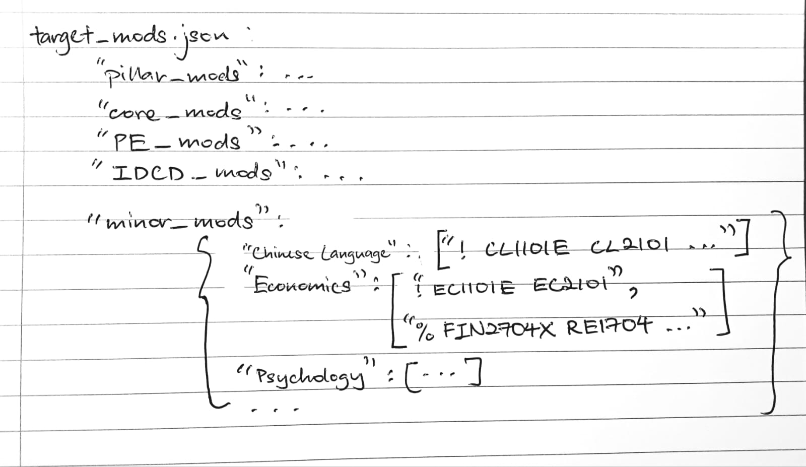

Feel free to skip ⏭️ to any chapters or versions that interest you 😊.

## Table of Content 📖
Chapter 1: Syncing with NUSmods
- 1.1: [Getting to know the API](#11-getting-to-know-the-api) 
- 1.2: [Modules for 6 Pillars](#12-modules-for-6-pillars) 
- 1.3: [Core and Programme Elective Modules](#13-core-and-programme-elective-modules) 
- 1.4: [Interdisciplinary & Cross-Disciplinary Modules](#14-interdisciplinary-&-cross-disciplinary-modules)


Chapter 2: Module Arrangement and Configuration
- 2.1: [Modules of Minors](#21-modules-of-minors)
- 2.2: [Modules of Majors](#22-modules-of-majors-tbc) (TBC!)
- 2.3: [Module Formatting](#23-module-formatting)

Chapter 3: placeholder
- 3.1: [](#31-)

Chapter 4: placeholder
- 4.1: [](#41-)


## 📚 Documentation

## Chapter 1 - Syncing with NUSmods

### 1.1: Getting to know the API

First, we need to figure out how the NUSmods API functions, and how we can use it for our purposes. There are 2 main ways we can use it:

1) Calling individual modules
    - While this method is limited as you can only call modules one at a time, it gives you a more detailed description of the module. It gives information such as its pre-requisites, workload, module credits, and many more.

    ```
    API link: 'https://api.nusmods.com/v2/2025-2026/modules/CS2030.json'

    Output:
    
    {
    "acadYear": "2025/2026",
    "preclusion": "If undertaking an Undergraduate DegreeTHEN( must not ...
    "preclusionRule": "PROGRAM_TYPES IF_IN Undergraduate Degree THEN (COURSES (1)...
    "description": "This course is a follow up to CS1010. It explores two modern programming...
    "title": "Programming Methodology II",
    "additionalInformation": "",
    "department": "Computer Science",
    "faculty": "Computing",
    "workload": [
        2,
        1,
        2,
        3,
        2
    ],
    "gradingBasisDescription": "Graded",
    "prerequisite": "If undertaking an Undergraduate DegreeTHEN( must have completed 1 of CS1010...
    "prerequisiteRule": "PROGRAM_TYPES IF_IN Undergraduate Degree THEN (COURSES (1) CS1010:D...
    "moduleCredit": "4",
    "moduleCode": "CS2030",
    "attributes": {
        "mpes1": true,
        "mpes2": true
    },
    "semesterData": [
        {
        "semester": 1,
        "timetable": [
            {
            "classNo": "10A",
            "startTime": "1000",
            "endTime": "1200",
            "weeks": [
                3,
                4,
                5,
                6,
    
    ...1134 more lines
    ```
    
    As you can see, its a lot of information. Much more than what this project requires, so we will only be taking what we need.

2) Calling all modules in a specified academic year
    - Like mentioned above, it provides an array containing every single module available for that year. However, it does not provide as much detailed information as the first method, just a brief lowdown.

    ```
    API link: 'https://api.nusmods.com/v2/2025-2026/moduleList.json'

    Output:

    [
    {
        "moduleCode": "ABM5001",
        "title": "Leadership in Biomedicine",
        "semesters": [
        3
        ]
    },
    {
        "moduleCode": "ABM5002",
        "title": "Advanced Biostatistics for Research",
        "semesters": [
        2
        ]
    },
    {
        "moduleCode": "ABM5004",
    
    ...51,354 more lines
    ```

    The information provided for each module is much less, but the json contains the entirety of NUS's module list for the 2025/2026 academic year.

Common API etiquette is not overloading the API link with many requests at a time. To prevent this, I'll be storing the 2025/26 year's module list into a JSON file. 

I'll also store a sample module's (CS2030) information, so I know what information I get when I call the NUSmods API using the first method.

First, lets create a function that can call the API, convert the response to JSON data, and save that data in a JSON file.

```
def from_api(api_link, save_json=False, json_filepath = 'testAPI.json'):
    response = requests.get(api_link)
    data = response.json()

    if save_json:
        with open(json_filepath, 'w') as f:
            json.dump(data, f, indent=2)
            print('saved to json')
```

Great, now we can store the data retrieved from the API calls.

```
from_api(api_link='https://api.nusmods.com/v2/2025-2026/modules/CS2030.json', save_json=True)

from_api(api_link='https://api.nusmods.com/v2/2025-2026/moduleList.json', save_json=True, json_filepath='all_mods.json')
```

Now that we are acquainted with the API, we can start diving deeper into the modules, starting with those in the 6 pillars. 

### Chapter 1.2: Modules for 6 Pillars

One thing all NUS students have to do, regardless of degree, is fulfill the 6 University pillars. To fulfill a pillar, you have to do at least 1 module from that pillar. 

For BAIS students, the 'Digital Literacy' and 'Computing Ethics' pillar is fulfilled from doing *CS1010A* and *IS1108* respectively. For the other 4 pillars, they are free to choose from the wide selection of modules the pillar offers.

To sift the unique pillars out, we can check their prefixes and assign them to their parent pillar. 

```
all_mods_list = read_json('all_mods.json')

pillar_mods = {
    'GEX': [],
    'GEC': [],
    'GES': [],
    'GEN': [],
}
```

We begin with getting the entire module list from the JSON file we saved in the previous commit. I also define a dictionary to organise the pillar modules.

```
for mod in all_mods_list:
    modCode = mod['moduleCode']
    prefix = modCode[:3]
    if prefix in pillar_mods:
        pillar_mods[prefix].append(modCode)

pillar_mods['default'] = ['CS1010A', 'IS1108']

to_json('target_mods.json', [pillar_mods])
```

Then, I loop through all the modules in the 2025/26 year and check the first 3 characters of the module code. If it corresponds with any of the dictionary keys, I append the module to the list.

After filling the lists of the 4 non-computing pillars, I make a separate key 'default' and add the 2 default pillar modules to its list. Lastly, I save the dictionary as a JSON file. 

```
[
  {
    "GEX": [
      "GEX1000",
      "GEX1003",
      ...
    ],
    "GEC": [
      "GEC1001",
      "GEC1002",
      ...
    ],
    "GES": [
      "GES1002",
      "GES1002T",
      "GES1003",
      ...
    ],
    "GEN": [
      "GEN2000",
      "GEN2001",
      ...
    ],
    "default": [
      "CS1010A",
      "IS1108"
    ]
  }
]
```

Notice how I save it as an array. This is because we will be adding more dictionaries to the JSON file, which will take care of programme elective (PE) and unrestricted elective (UE) modules, etc.

##### shld i do nested dicts for lvl 1k and 2k pillar mods??? hmmm

### Chapter 1.3: Core and Programme Elective Modules

Next, we need to add all the BAIS core modules to the target modules JSON. Nothing too technical here, just copy pasting the module names from the NUS BAIS website curriculum.

After some thought, I've decided not to save the target modules as an array, but rather as a dictionary to make it more organised.

```
target_mods_list = read_json('target_mods.json')
target_mods_list = target_mods_list[0]
target_mods = {
    'pillar_mods': target_mods_list,
    'core_mods': ['BT2102', 'CS2030', 'CS2040', 'IS2101', 'IS2108', 'IS2109', 'IS3103', 'Ind_XP_req/CP4101', 'IS4108', 'MA1521', 'MA1522', 'ST2334']
}
to_json('target_mods.json', target_mods)
```

After calling the list of target mods, I extracted the dictionary from the array, then replaced the array with a dictionary 'target_mods'. 

I added the key 'core_mods' and its array values, then wrote the new target_mods JSON back to its file. Now we need to do the same for the PE mods, which is slightly more troublesome.

First, I copied the PE mods from the NUS website:

```
PE_string = '''
Digital Business
IS3150 Digital Media Marketing
...

Financial Technology
IS4226 Systematic Trading Strategies and Systems
...

IT Solutioning
CS2105 Introduction to Computer Networks
...

AI Solutioning
BT3017 Feature Engineering for Machine Learning
...

IT Business Innovation and Entrepreneurship
CP3100 Information Systems and Analytics Research Methodology
...

IT Security and Legal Aspects
CS2107 Introduction to Information Security
...
'''.strip()
```

The ''' is used for multi-line strings in python, and the '.strip()' at the end removes any unwanted '/n' at the start or end of the string.

```
PE_groups = PE_string.split('\n\n')
PE_mods = {}
for grp in PE_groups:
    parts = grp.split('\n')
    title = parts.pop(0)
    PE_mods[title] = [string.split(' ')[0] for string in parts]

target_mods = read_json('target_mods.json')
target_mods['PE_mods'] = PE_mods

print(target_mods)
to_json(target_mods)
```

PE_groups is an array of module groups, grouped by 'Digital Business', 'Financial Technology', etc. Then, I loop through each group and split them further using split('\n').

This makes the first value in the split group list the title, and the rest of the values are the modules. To just get the module codes without the module names, I split the modules using the spacings with split(' ') and singled out the first value, which would be the module code.

I attach the list of module codes as the value to the group title key in the dictionary 'PE_mods'. When I'm done doing this for all the groups, I add the dictionary to 'target_mods' and save it back to the JSON file.

Before we move on to the next subchapter, I'd like to segregate the programme elective modules further into level groups. So lets load the target_mods JSON in again.

```
target_mods = read_json('target_mods.json')
PE_mods = target_mods['PE_mods']

for title, mod_list in PE_mods.items():
    new = {
        '2k': [],
        '3k': [],
        '4k': []
    }
    for mod in mod_list:
        lvl = f'{mod[-4]}k'
        new[lvl].append(mod)
    PE_mods[title] = new

target_mods['PE_mods'] = PE_mods
to_json(target_mods)
```
Basically, I extract the list of modules for each PE group, and organised them into a dictionay called 'new' according to their level, which is indicated by the 4th last character in the module code.

After assigning 'new' to each group key as its new value in the key-value pair for every group, I write the PE_mods back to target_mods, and target_mods back to the JSON file.

### Chapter 1.4: Interdisciplinary & Cross-Disciplinary Modules

Inside this [txt file](ID_mods.txt) is some text copy-pasted from the NUS SoC website containing all the ID courses. As for the CD module [txt file](CD_mods_pt1.txt), it is slightly different in that its not complete.

If you refer to Appendix C in the [SoC website](https://www.comp.nus.edu.sg/cug/soc-22-23/) and scroll past all the listed modules, you will see a message at the bottom that says: 

'Any course from Chemistry, Physics, or Biological Sciences departments starting with codes PC, CM, LSM, ZB respectively.'

So we will have to add those to target_mods.json, on top of the other CD modules listed. But before that, lets add the ID mods.

```
ID_mods = []
with open('ID_mods.txt', 'r', encoding='utf-8') as f:
    div = 0
    for line in f:
        if div % 3 == 0:
            modCode = line.split(' ')[0]
            ID_mods.append(modCode)
        div += 1

target_mods = read_json('target_mods.json')
IDCD_mods = {'ID_mods': ID_mods}
target_mods['IDCD_mods'] = IDCD_mods

print(target_mods['IDCD_mods'])
to_json(target_mods)
```

After singling out every 3rd line (the line containing the module code), I split the line and appended the first string (which is the mod code) to the `ID_mods` array.

Then, I added an 'IDCD_mods' key to the target_mods dict, and added another dictionary as its value, which will hold the 'ID_mods' and 'CD_mods' keys.

For the CD modules, we will have to do some extra work. We start with the same thing we did for the ID modules, sifting through the txt file and appending all the mod codes to an array.

```
CD_mods = []
with open('CD_mods_pt1.txt', 'r', encoding='utf-8') as f:
    div = 0
    for line in f:
        if div % 3 == 0:
            modCode = line.split(' ')[0]
            CD_mods.append(modCode)
        div += 1
    print(len(CD_mods))

Output: 18
```

But remember, we still need to add any modules that have the prefix PC, CM, LSM, or ZB. We can do that by looking through [all_mods.json](all_mods.json).

```
all_mods = read_json('all_mods.json')
for dict in all_mods:
    modCode = dict['moduleCode']
    potential = ['PC', 'CM', 'LSM', 'ZB']
    for pot in potential:
        if pot in modCode:
            CD_mods.append(modCode)

print(len(CD_mods))

Output: 368
```

Now all thats left is to add the array to the target_mods dictionary.

```
target_mods = read_json('target_mods.json')
target_mods['IDCD_mods']['CD_mods'] = CD_mods

to_json(target_mods)
```

That concludes our work for syncing the ID and CD modules to BAISmods. This way, you dont have to look for the modules, which you have to when using NUSmods. 

Here, we provide the list of modules applicable for ID and CD education use.

## Chapter 2: Unrestricted Modules

### 2.1: Modules of Minors

Ok, lots to be done for this subchapter. First thing to do is list out all NUS minors of interest.

**1) Chinese Language**:

*Pass 5 modules: CL1101E, CL2101, CL2102, CL2103, CL3104*

**2) Economics**: (tough)

*Pass EC1101E, EC2101, and 12 units from EC or EC-recognised courses*

EC-recognised mods:

*FIN2004/FIN2004X/FIN2704/FIN2704X Finance*
*RE1704 Principles of Real Estate Economics*
*RE2705 Urban Economics*
*MA1102R / MA2002 Calculus*
*MA1521 Calculus for Computing*
*ST3131 Regression Analysis*

**3) Psychology**

*Pass PL1101E, and 16 units (4 mods) from the following:*

*PL2131 Research and Statistical Methods I*
*PL3102 Biological Psychology*
*PL3103 Cognitive Psychology*
*PL3104 Developmental Psychology*
*PL3105 Social Psychology*
*PL3106 Mental Health and Distress*

**4) Geosciences**

*Pass GE2103, XD3103, 4 units from Grp A, and 8 units from Grp B*

Group A:

*CM1102 Chemistry - The Central Science*
*CM1417/CM1417X Fundamentals of Chemistry*
*LSM1103/LSM2252 Biodiversity*
*LSM1301/LSM1301FC/LSM1301X General Biology*
*PC1201 Fundamental of Physics*

Group B:

*GE2215 Introduction to GIS*
*GE3210 Natural Resources: Policy and Practice*
*GE3231 Natural Hazards*
*GE3250 Nature and Society*
*GE3253 Weather and Climate*
*GE3255 Aquatic, Riparian and Coastal Systems*
*GE3256 Earth Surface Processes, Landforms and Ecosystems*
*LSM2251 Ecology and Environment*
*LSM3254 Ecology and Aquatic Environments*
*LSM3255 Ecological of Terrestrial Environments*
*EC3383 Environmental Economics*
*HY2235 Environmental History*
*CE2134/ME2134 Fluid Mechanics*
*CE3132 Hydrology and Free Surface Flows*
*CM3261 Environmental Chemistry*
*ESE2001 Environmental Challenges in the Anthropocene*

**5) Interactive Media Development**

*Minimum 2 modules from Grp A and 2 modules from Grp B*

Group A:

*CS1010/variant*
*CS3240*
*CS3249*
*CS4240*
*CS4249*
*CS4350*

Group B:

*NM3217*
*NM3230*
*NM3243*
*NM4259*
*NM4260*
*NM5219R*

**6) Architectural Studies**

*Pass AR1101A, AR1328A, AR2227, and 4 units (1 mod) from the following:*

*AR1329*
*AR2225*
*AR2228*
*AR3223*
*CDE2501*
*CDE2502*
*CDE2503*
*CDE3504*
*CDE3505*

**7) Biomedical Engineering**

*Pass BN1111/BN1112 and BN2111/BN2112, as well as 3 mods from the following:*

*BN2104, BN2105, BN2201, BN2204, BN2301, BN2404, BN3405, BN3406*

**8) Hydrogen and Low Carbon Technology**

*Pass CN1101A/MLE1001B, CN2103, CN4252, and 2 modules from the following*

*CN4235, CN5190, MLE2102, MLE4210, MLE4221*

**9) Landscape Architectural Studies**

*Pass LAD1003, LAD2004, LAD2009, and 2 modules from the following:*

*LAD2003, LAD2005, LAD2010, LAD4006*

**10) Project Management**

*Pass PF1101A and 4 modules from the following:*

*PF2108, PF2109, PF2203, IPM3103, PF3104, PF3208, PF4102, PF4203*

**11) Visual Communication Design**

*Pass ID2119, ID3130, and 3 modules from the following:*

*ID3132, ID3131, ID1121, ID3126, ID3131, CDE2000, DTK1234*

**12) Infrastructure Management and Finance**

*Pass 5 modules from the following:*

*PF1101A, IPM3103, PF3305, PF4309, RE2705, FIN2704, RE3701, RE4803, CE3121, CE4221*

**13) Integrative Health**

*Pass MIH1101, MIH1102, MIH2201, MIH2202, MIH3201*

**14) Analytical Chemistry**

*Pass CM1102, CM2133, CM2143, CM3141, CM3192*

**15) Bioinformatics**

*Pass ZB2101, ZB3101, and 3 modules from the following*

*CS1010/variant, CS2040/variant, CS4220, MA3259, ZB2201, ZB3288, ZB4171, LSM4231, LSM4241*

**16) Biophysics**

*Pass PC1101, PC2267, PC3267, and 2 modules from the following*

*PC2031, PC2135, LSM2106, LSM2234, LSM2241, LSM3220, LSM3243, PC4267, LSM4231*

**17) Chemistry**

*Pass CM1102, CM2112, CM2122, CM2133, CM2143*

**18) Physics**

*Pass PC1101, PC2174A, PC2193, and 2 modules from the following:*

*PC2031, PC2032, PC2130, PC2135*

**19) Statistics**

*Pass ST1131, MA1521, ST2334, ST2132, ST3131/ST32xx (except ST328x mods)*

**20) Quantitative Finance**

*Pass QF1100, ST2334, QF2104, QF3101, and 1 mod from the following:*

*QF3103, ST3131, EC3303, FIN3702/ABCD, FIN3716*

**21) Medical Physics**

*Pass GEH1032, PC3294, PC3295, and 2 mods from the following*

*LSM2106, LSM2212, LSM2231, LSM2233, LSM3243, LSM3223, LSM4243*

### 2.2 Modules of Majors (tbc!)

### 2.3: Module Formatting

So far, that makes a total of 21 selected minors to be included in BAISmods. I've added the minors and their requirements to a [text file](minors.txt), but its still not in an arrangement that is favourable for parsing by python.

I'll be implementing a format to minors.txt that will look quite silly, but works when I have to read the txt file from a python file in the future. 

Lets run through the start of the txt file briefly. It might not be the most efficient way, and theres probably a hundred better ways to do this, but please don't laugh at me.

```
) Chinese Language
! CL1101E CL2101 CL2102 CL2103 CL3104

) Economics:
! EC1101E EC2101
% FIN2704X RE1704 RE2705 MA2002 MA1521 ST3131 3

...
```

I use 4 unique characters to determine what kind of data the line of text is giving me: ')', '!', '%', and '<'

**')'** tells me that the line just contains the name of the minor, while **'!'** tells me that all the modules on the line are needed to clear the aforementioned minor.

**'%'** tells me that I need to pick x number of modules from the ones listed in that line of text, and the value x is written at the end of the line. 

EG: `% FIN2704X RE1704 RE2705 MA2002 MA1521 ST3131 3` means I need to pick 3 modules from this line of text.

**'<'** is similar to '%', except you have to pick *minimum* x number of modules.

EG: `< CS1010A CS3240 CS3249 CS4240 CS4249 CS4350 2` means you have to pick a minimum of 2 mods from the list

Now its time to add all these to `target_mods.json`. I'll be arranging them in this order:



Fig 2.1: Module arrangement in target_mods.json

To do this, we need a lil code to 1) extract information from the txt file and 2) parse the lines of text before adding it to the target_mods dictionary.

```
minor_mods = {}
with open('minors.txt', 'r') as f:
    paragraphs = f.read().split('\n\n')
    for para in paragraphs:
        lines = para.split('\n')
        minor = lines.pop(0)[2:]
        print(minor)
        minor_mods[minor] = lines
```

After splitting the text into its paragraphs, I loop through them into each para, then split the para further.

`lines` is a list of all the lines of text in the para, with `minor` being the first line. I remove the first 2 characters ') ' to obtain the minor name before adding it as a key to the 'minor_mods' dictionary.

```
target_json = read_json('target_mods.json')
target_json['minor_mods'] = minor_mods
to_json(target_json)
```

After adding the rest of the lines as its value, I add 'minor_mods' into 'target_mods' after all the paeas have been dealt with.

### 2.4: Module 'pre-requisites' and 'required_fors'

Before anyone says 'you can just use the prerequisite tree which you get when you specify a single module in the API call', I didn't want to call the API for every module.

This would *100%* overload the API created by my soon-to-be seniors and piss them off, all before I've even matriculated.

The only thing we can work with is the 'prerequisite string', which is provided when you call moduleInfo from the API. It provides slightly more information that simply calling moduleList.

First, I'm going to add a new key-value pair to each module object in [all_mods.json](all_mods.json): `'req_for': []`

```
all_mods = read_json('all_mods.json')
for dict in all_mods:
    dict['req_for'] = []
```

The array will contain all the modules that have **this** mod as a pre-requisite. Kind of like the opposite of a pre-requisite. Get it? No? Ok, [see me after class](https://t.me/milkbottledude).

Thats the 'required for's done, now for part 2 which is the assignment of prerequisites.


