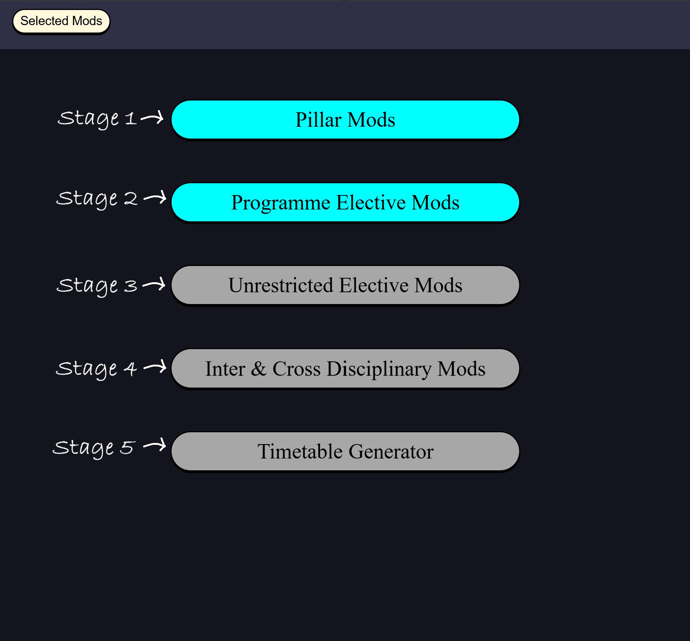
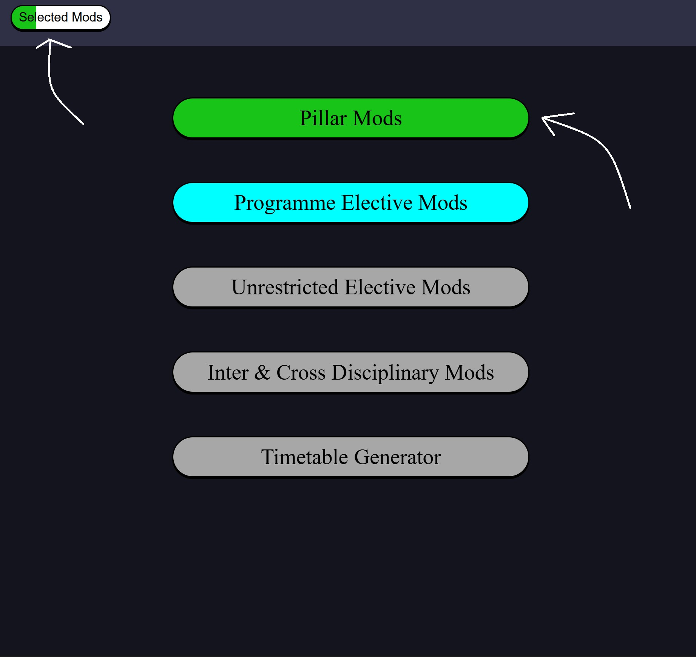
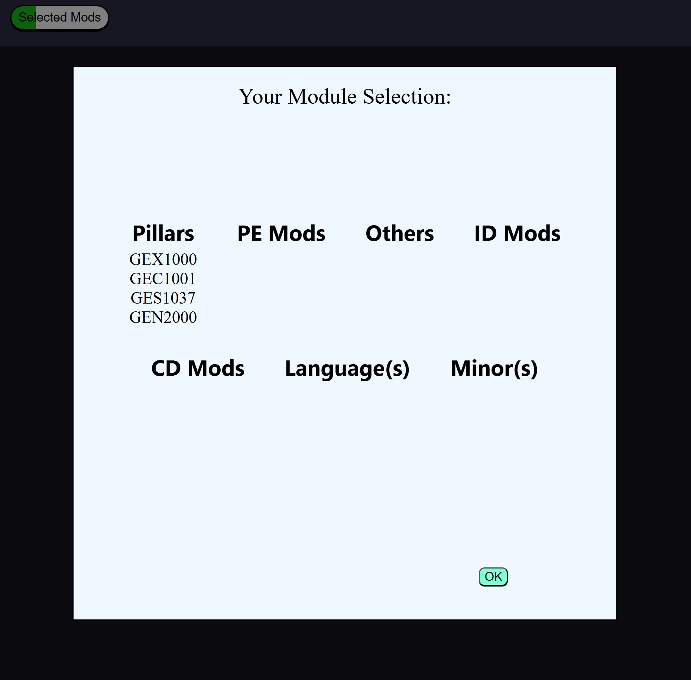
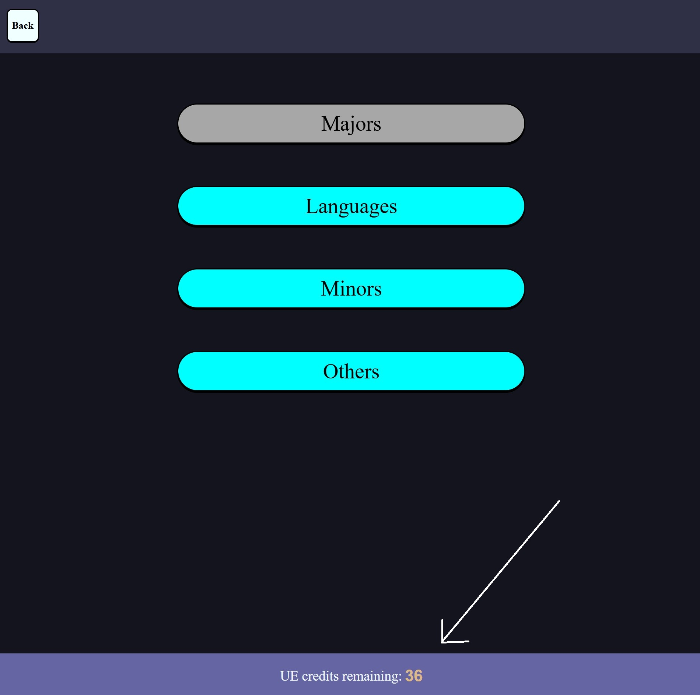
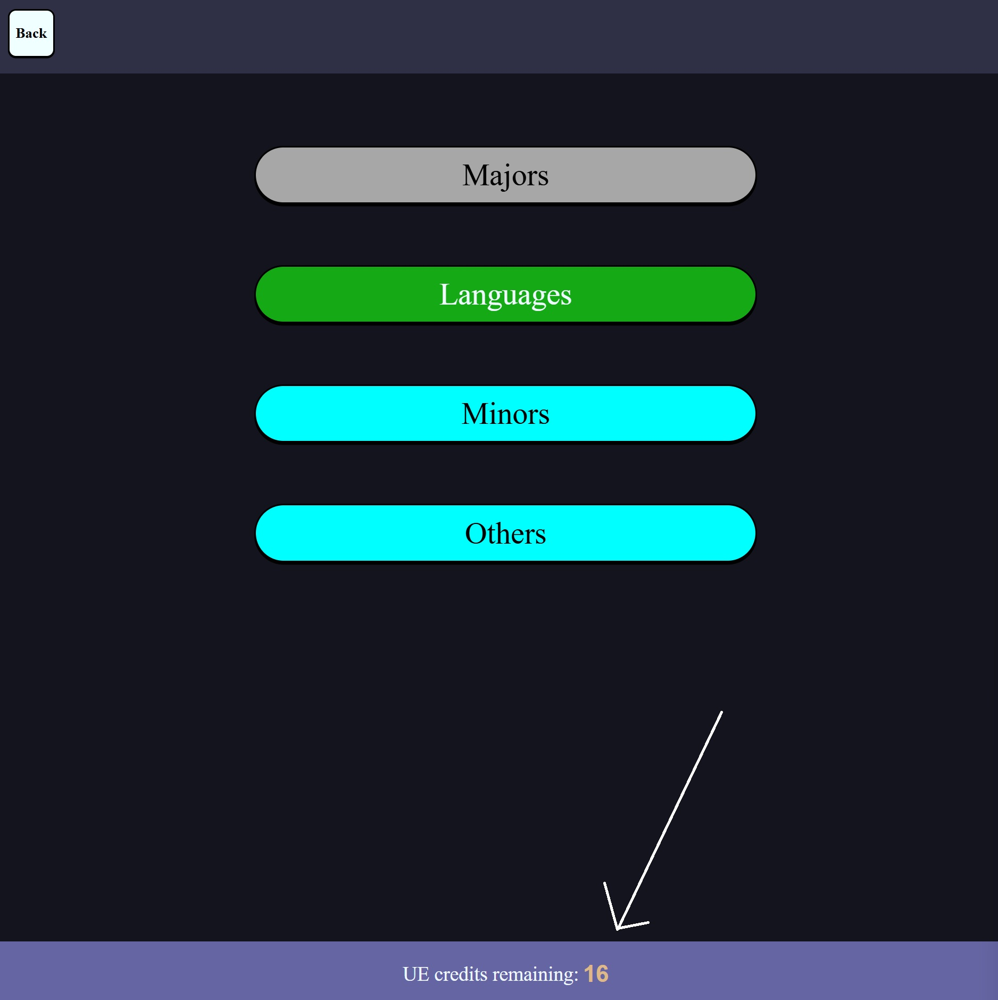
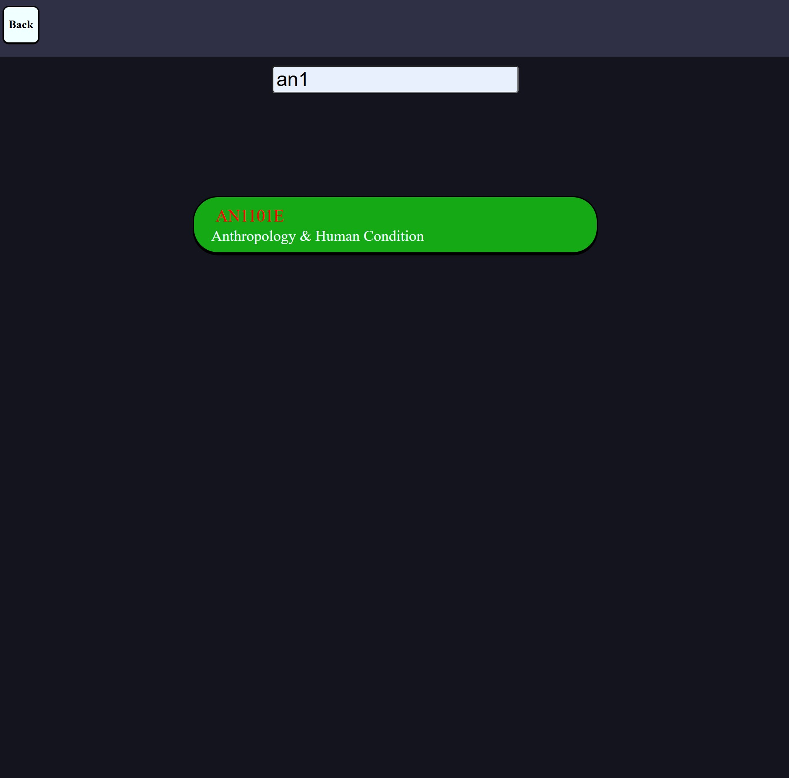
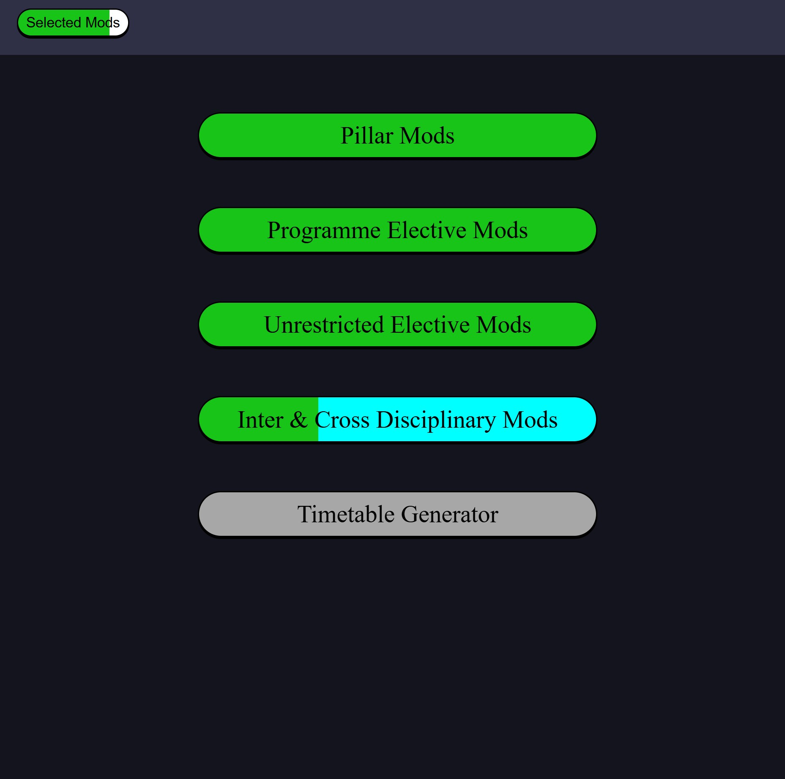
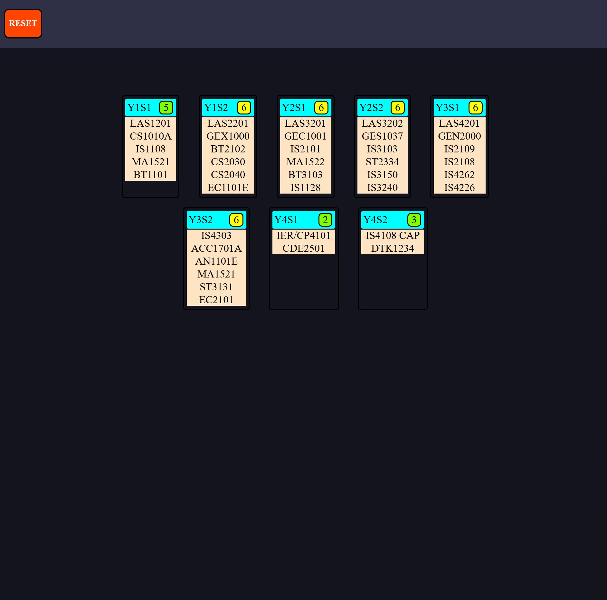

# Project: BAISmods

- [Overview](#overview-)
- [How to Use](#how-to-use-)

## Overview 🔍
Welcome to Project: NUSmodsPlus!

Those who are familiar with NUSmods will know its a very useful tool for anything module related. It also lets you plan your module schedule for the whole 4 years you will spend in NUS.

However, its quite a hassle arranging the modules for the 4 years, as some modules have pre-requisite modules that you have to take prior. 

While NUSmods' planner does alert you when you try to place a module into planner without having done its pre-requisite mod, its rather buggy when BAIS modules are involved. Take a look at Figure a below:

**Fig a**: Missing module IS3109 in NUSmods planner feature

Thats because BAIS (Business Artificial Intelligence Systems) is a rather new degree, with its first batch of students entering just this year (academic year 2025/2026).

So while we will be using NUSmods' API to retrieve module details, we will be constantly referencing the official curriculum, which can be found at the [NUS BAIS website](https://www.comp.nus.edu.sg/programmes/ug/bais/curr/), and filling in any information gaps that surface.

Additionally, when wanting to take minors or majors using UEs (unrestricted electives), it would help to know which minors/majors have double-counted mods, as overlapping mods would make these minors or majors easier to complete.

Of course, it would also be helpful to see what minors and majors the user is **not** eligible to take due to **exceeding** the max number of double-count module units (8 units for minors, 16 for majors).

One more advantage BAISmods will have over NUSmods, besides the fact that we will have the most up to date information on BAIS modules, is that BAISmods is ONLY for BAIS students.

This means users dont have to look for what modules they need to take to clear their common requirements. Users don't have to surf through the BAIS curriculum to see what the degree's core modules are. Users don't have to see what mods are included in the programme elective courses.

Users don't have to do unnecessary searching, users save time. Users happy :)

**In summary**, what BAISmods can do (that NUSmods can't) is:

1) Tell user what mods they have to take to clear requirements (for pillar modules and programme electives)
1) Tell user if they have not completed the pre-requisite of the BAIS module they wish to take
2) Tell user which majors/minors they have partially completed based on prior completed modules
3) Tell user if their chosen programme electives are acceptable (eg: < 3 courses above level 4k)
  - 

4) Arrange mods for the user over their 4 years, with features such as:
  - letting user choose which semesters they want to overload (except Y1S1, Y4S1 & Y4S2)
  - Automatically arranges user's mods in the sems based on whether their pre-requisites are completed
  - Also puts higher priority mods in earlier sems

## How to Use 🤔

The BAISmods webapp has 5 stages:

**Fig c**: 5 stages of the BAISmods webapp experience

#### 1) Pillar Mods

- Fairly straightforward, just go inside and pick one GE mod of your liking from each GE category. Once done, you can press the back button on the top left.

- When you go back, you will notice some changes. The 'selected mods' bar in the top left is a quarter green, and the 'pillar mods' tile is fully green. Thats because you have completed Stage 1.

- You can also click into the 'selected mods' bar to see what modules you have selected so far. When done, just click the 'ok' button.

#### 2) Programme Electives

- When you enter the PE mods tile, you can choose up to 5 mods. The webapp will prevent you from exiting if you 1. have not chosen 5 mods, or 2. have not chosen 3 mods of at least level 4000.

- Some of the mods also serve as pre-requisites to others. This updates in real time, as you can see below: When I select IS2102, which is a pre-requisite to IS4100 and IS4234, their pre-requisite number decreases.

- After selecting your 5 PE mods and clicking 'back', the webapp will alert you to any undone pre-requisites and auto add them to your module selection as *unrestricted elective* mods.

- **Additionally**, if any of the pre-requisites are *IDCD* mods, they will be added under that category instead of as a UE mod, saving your UE credits and filling up the IDCD requirement.

#### 3) Unrestricted Electives

- The UE mods tile allows you to choose what UE mods to fill up your 40 credits, be it minors or languages, or just individual mods (Others). Majors are still currently in the works, hence why its greyed out.

- You can also see how many more credits you have left until you fulfill the BAIS UE mods minimum requirements at the bottom of the screen. If you recall, one of the PE mods had a pre-requisite which was assigned as a UE mod under 'Others', hence the number is *36* and not 40.

**Part 1: Languages**

- Here you can choose from 12 languages of varying levels. Most languages offer 6 levels but there are exceptions, with Korean offering up to 8 levels and Tamil offering a measly 2 levels.

- You can choose a maximum of 2 languages. For this webapp demonstration, I'll just be going with 1 language, Spanish level 5, as an example.

- Upon exiting, you can see that the UE credits remaining has decreased.

**Part 2: Minors**

- In the Minors page, the number of mods required for each minor is displayed on the right of each minor tile, some with smaller mod requirements than others which could be due to double counting. This is another helpful feature of BAISmods, it helps you account for minor mods you have already done.

- For example, since Interactive Media Development (IMD) requires a CS1010 variant, and BAIS curriculum already has CS1010A as a core module, it can be double counted, reducing what was initially 4 modules to complete for the IMD minor, to now 3.

![Fig-o]

- For this demonstration, I will be choosing the 'Economics' minor.

- Inside each tile, the requirements for each minor is shown in greater detail. Pressing the 'All of' tiles will drop down an array of mods, all of which you are required to take to fulfill the minor. As for the '*x* of' tiles, where *x* is a number, you need only select *x* number of mods from the dropdown window.

- Similar to the PE mods page, the number of pre-requisites for each mod is also shown below it. The undone pre-requisites will also be flashed to you prior to exiting the page, and will be auto added to your module selection as either 'IDCD' mods or 'Others' mods.

**Part 3: Others**

Lets say you want to take a UE mod by itself instead of with a minor. You can enter the 'Others' tile and key in the mod of your choice there.

- For example, I could want to know more about humans and our species background. Then AN1101E is a good choice, level 1k and with no pre-requisites.

- (*In the works*) I also have plans to integrate a small neural network model into BAISmods (in-house, no LLM API here) so that you can just describe a mod and it will return mods that fit your description.

#### 4) IDCD modules (if IDCD requirement has not been fulfilled)

If you recall from earlier when we were choosing PE mods, one of the pre-requisite mods (IS1128) happened to be an ID mod, so we have 1/3 IDCD mods. 

- Since the requirement is not fulfilled, we must enter the IDCD tile and choose another 2 IDCD mods, with no more than 1 CD mod.

As you can see, the webapp will signal if you already have 3 total IDCD mods selected, or if you try to choose > 1 CD mod. In this case, I chose 2 extra ID mods to complete the trio.

#### 5) Mod to Sem Timetable Generator

Now that we have chosen all our mods and the 'selected mods' progress bar is fully green, the 'Timetable Generator' tile is unlocked. Before clicking into it, its a good idea to take a look at what mods we have chosen.

**Part 1: Overloading Sems**

By default, each semester will have 5 mods per sem. However, we did select quite a number of unrestricted electives.

Furthermore, since IS4108 Capstone Project and Industry Exp Requirement are large mods that only allow 1 and 2 mods to be taken in the same sem respectively, we have no choice but to choose some semesters to overload.

The webapp calculates how many module spaces extra you have, but the distribution of them across the semesters is up to you, excluding Sem 1, Sem 7, and Sem 8 (Y1S1, Y4S1, Y4S2).

- In this case, we need to distribute 5 extra mods. Pressing the '+' increases the number of extra mods the semester will contain **on top** of the default number of mods it already holds. 

- As I like my workload even, I added 1 extra mod across all the available sems, bringing the excess mod number to 0 and allowing us to now generate our 8 semester BAIS timetable.

**Part 2: Timetable Generation**

- After pressing the green 'Generate' button and waiting 1-2 seconds, the webapp will give you a full 8 semester timetable, combining the BAIS core modules, IS4108 Capstone Project and IER with your personal blend of pillar, IDCD, programme elective, and unrestricted elective modules with all pre-requisites accounted for.

- The green/yellow (and possibly red) squares with numbers inside, next to the semester labels, indicate the number of modules within that sem. 

- So originally, the numbers were as follows: 5, 5, 5, 5, 5, 5, 2, 3. So after taking into account the overloaded sems, of which I distributed evenly across sems 2-6, that arrangement has now become: 5, 6, 6, 6, 6, 6, 2, 3.

After you are done marvelling at how amazing my webapp is (im joking a kid could prob vibecode this in 1 day), you can press the red 'reset' button in the top left corner should you decide to change your module selection.

And thats it for the BAISmods tutorial. Feel free to [telegram me](https://t.me/milkbottledude) if you have any issues/feedback on the webapp, or just want to chat :)